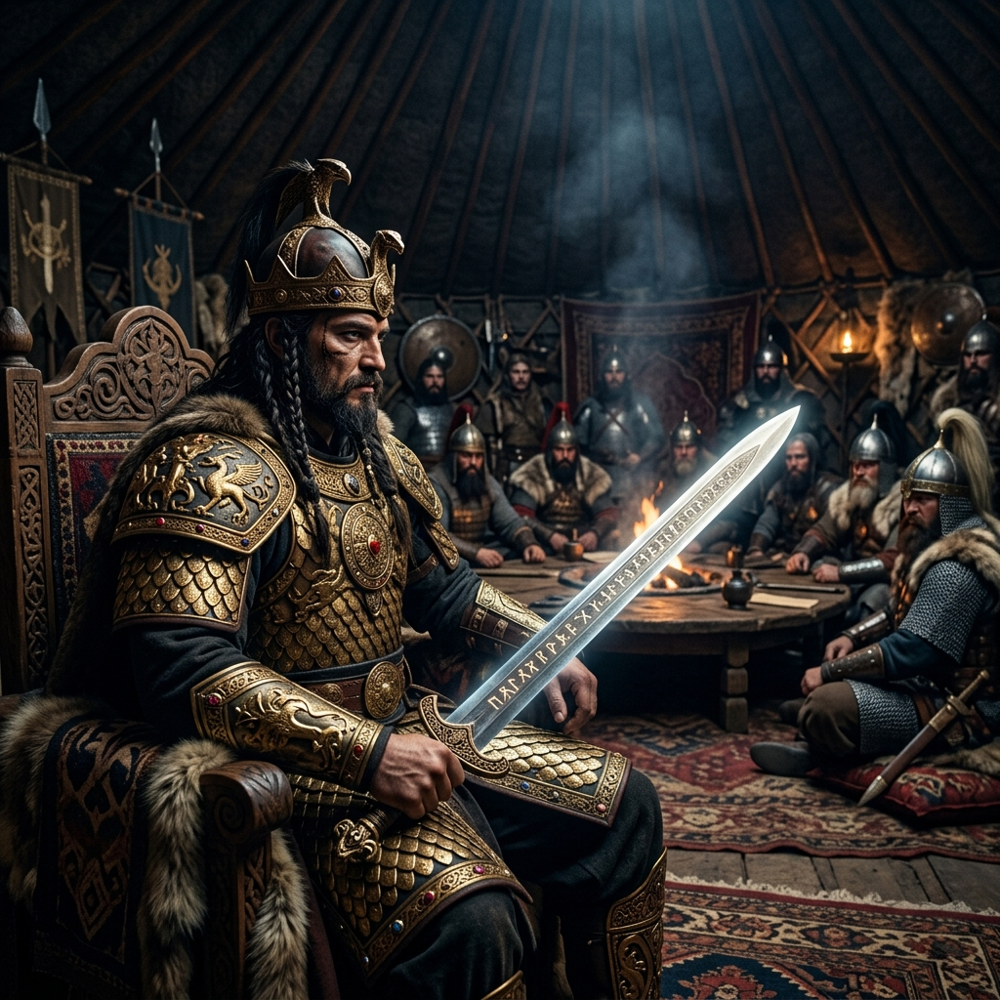
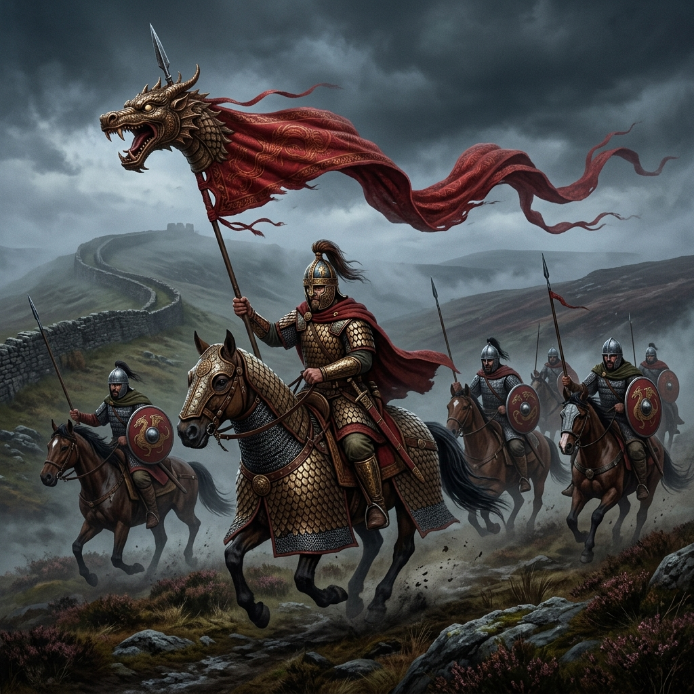

# Kral-Arthur-Turk-Tezi (The Sarmatian-Turkic Connection)

Bu dijital arşiv, Britanya mitolojisinin en ikonik figürü olan **Kral Arthur** ve **Yuvarlak Masa Şövalyeleri** efsanesinin kökenlerini, Avrasya bozkırlarına ve antik Türk/Sarmat kültürlerine dayandıran bilimsel teorileri, etimolojik benzerlikleri ve tarihsel verileri bir araya getirmek amacıyla oluşturulmuştur.

---

## 📌 Proje Özeti ve Vizyon: "Bozkırın Britanya Çıkartması"
Geleneksel tarih yazımı Kral Arthur'u bir Kelt kahramanı veya Roma sonrası bir Briton lideri olarak tanımlasa da, 1970'lerden itibaren güçlenen **"Sarmat Bağlantısı" (Sarmatian Connection)** teorisi, efsanenin çekirdeğinin MS 175 yılında Roma İmparatoru Marcus Aurelius tarafından Britanya'ya gönderilen 5.500 kişilik Sarmat süvari birliği olduğunu savunur.

Bu proje, bu teoriyi sadece bir "göç" vakası olarak değil, **Türk Tarih Tezi** ve Avrasya Bozkır kültürü perspektifiyle, mitolojik arketiplerin nasıl kıta değiştirdiğini kanıtlarıyla inceleyen dinamik bir bilgi üssüdür.

---

## 📂 Proje Yapısı ve Navigasyon

Araştırmanın derinliklerine inmek için aşağıdaki modülleri kullanabilirsiniz:

*   📜 **[Zaman Çizelgesi](timeline.md):** MS 175'teki ilk sevkiyattan modern akademik çalışmalara kadar olan kronolojik süreç.
*   📜 **[Etimoloji Laboratuvarı](etymology/etimoloji_tablosu.md):** Arthur, Excalibur, Lancelot ve Pendragon gibi isimlerin Türkçe/Bozkır dillerindeki izdüşümleri.
*   📜 **[Akademik Literatür](documents/makale_ozetleri.md):** Littleton, Malcor ve Osman Karatay gibi otoritelerin çalışmalarının derinlemesine özetleri.
*   🖼️ **[Görsel Galeri](images/):** Sarmat askeri teçhizatı, Draco sancakları ve efsanenin Bozkır yorumlarına dair görselleştirmeler.

---

## 🛡️ Temel Kanıtlar ve Genişletilmiş Analiz

### 1. Tarihsel Temel: Sarmat Lejyonları ve Castus
MS 175 yılında, Marcomanni Savaşları'nın ardından 5.500 Sarmat (Yazıg) süvarisi, Roma İmparatorluğu'nun kuzey sınırlarını (Hadrian Duvarı) korumak üzere Britanya'ya "Bremetennacum" (günümüz Ribchester) merkezli olarak yerleştirilmiştir.
*   **Askeri Devrim:** Bu süvariler, Britanya'ya o güne dek görülmemiş bir askeri sınıf getirmiştir: **Kataphrakt (Ağır Zırhlı Süvari)**. Bu sınıf, Ortaçağ şövalyeliğinin teknik ve kültürel atasıdır.
*   **Artorius Castus:** Birliğin komutanı olan Lucius Artorius Castus'un hayatı, efsanevi "Kral Arthur"un tarihsel çekirdeğini oluşturur. Castus'un Armorica (Fransa/Bretanya) seferleri, Arthur'un kıta Avrupası seferleriyle paralellik gösterir.

### 2. Arkeolojik Kanıtlar: Ribchester (Bremetennacum) Bulguları
Hadrian Duvarı hattındaki arkeolojik kazılar, teoriyi somut verilerle desteklemektedir:
*   **Mezar Taşları (Stelae):** Ribchester'da bulunan ve üzerinde Sarmat tipi süvari figürleri (ejderha sancaklı ve ağır zırhlı) olan mezar taşları, bölgedeki yerleşik Sarmat varlığının en açık kanıtıdır.
*   **Zırh Kalıntıları:** Bozkır tipi "pul zırh" (scale mail) parçaları, Roma lejyonerlerinden farklı bir askeri ekolün Britanya'da kök saldığını göstermektedir.

### 3. Sosyal Yapı ve "Yuvarlak Masa"nın Töre Kökeni
Yuvarlak Masa şövalyeliği, Avrupa feodalizminden ziyade Bozkırın **"Anduz" (And İçme)** ve **"Kengeş" (Meclis)** geleneğiyle örtüşür:
*   **Eşitler Meclisi:** Bozkır beylerinin (Boy beyleri) bir hiyerarşiden ziyade, ortak bir merkez etrafında (Ocak/Ateş) eşit statüde toplanma geleneği, Yuvarlak Masa'nın sosyal prototipidir.
*   **Sadakat Yemini:** Arthur ve şövalyeleri arasındaki sarsılmaz bağ, Sarmat/İskit toplumlarındaki kan kardeşliği ve liderin etrafında toplanan "Comitatus" (Maiyet) sistemiyle birebir uyumludur.

### 4. Mitolojik Paralellikler: Bozkırın İzleri
Efsanedeki en önemli sahneler, antik İskit ve Sarmat ritüellerinde binlerce yıl önce yaşanmaktaydı:
*   **Taştan Çıkan Kılıç:** İskitlerin savaş tanrısı adına bir toprak yığınının tepesine diktikleri kılıca tapınma kültü, Arthur'un krallığını kanıtlamak için kılıcı taştan (veya örsten) çekmesi motifiyle doğrudan ilişkilidir.
*   **Kutsal Kase (Grail) ve Nart Destanları:** Kafkasya Bozkırlarında (Nart Destanları) bulunan ve sadece en layık olanın içebildiği **"Nartyamonga"** (Kutsal Kadeh), Kutsal Kase arayışının (Grail Quest) Bozkır kökenli prototipidir.
*   **Kılıcın Göle Atılması:** Arthur'un ölmeden önce Excalibur'un göle atılmasını istemesi, ölen liderin silahının suya veya gömütüne bırakılması şeklindeki Bozkır geleneğinin (Kurgan kültürü) bir yansımasıdır.

### 5. Sembolizm: Ejderha ve Bayrak
Sarmatların savaş meydanlarında kullandığı, rüzgarla dolup ıslık çalan ejderha başlı sancaklar (**Draco**), efsanevi "Pendragon" (Ejderhanın Başı) unvanının ve Galler'in milli sembolü olan kırmızı ejderhanın kaynağıdır.

---

## 🏛 Tarihsel Meta-Mühendislik ve Metodoloji
Bu proje, sadece veri toplamaz, veriler arasındaki **kültürel DNA transferini** modeller:
1.  **Karşılaştırmalı Folklor:** Nart Destanları (Batraz, Soslan) ile Arthur döngüsü (Arthur, Lancelot) arasındaki izomorfik motif analizi.
2.  **Linguistik Paleontoloji:** Türkçe, Macarca ve Alan dilleri üzerinden, Hint-Avrupa dilleriyle açıklanamayan terimlerin köken taraması.
3.  **Popüler Kültür Analizi:** 2004 yapımı *King Arthur* filmi gibi modern yapımların bu teoriyi nasıl kitlelere ulaştırdığının incelenmesi.

---

## 📚 Bibliyografya ve Referanslar
Araştırmanın temel direkleri:
*   **C. Scott Littleton & Linda A. Malcor:** *From Scythia to Camelot: A Radical Reassessment of the Legends of King Arthur, the Knights of the Round Table, and the Holy Grail*.
*   **Prof. Dr. Osman Karatay:** *İngiltere'de Neler Oldu?* (Arthur'un Türk dilli Sarmatlarla bağı üzerine en kapsamlı Türkçe eser).
*   **Kemp Malone:** *The Historical Arthur* (Artorius Castus üzerine öncü çalışma).
*   **Graham Phillips:** *King Arthur: The True Story* (Sarmat teorisinin alternatif dalları).

---

## 🤝 Katkıda Bulunma ve İletişim
Bu araştırma deponun ötesinde, yaşayan bir tezdir. Yeni arkeolojik veriler veya dilbilimsel keşifler için **Issue** açabilir veya doğrudan **Pull Request** ile katkı sağlayabilirsiniz.

---

## ⚖️ Lisans
Bu proje, tarihsel hakikatlerin özgürce paylaşılması için **MIT Lisansı** altında korunmaktadır.

> *"Kılıç sadece bir metal parçası değil, bir kültürün yeminidir."*